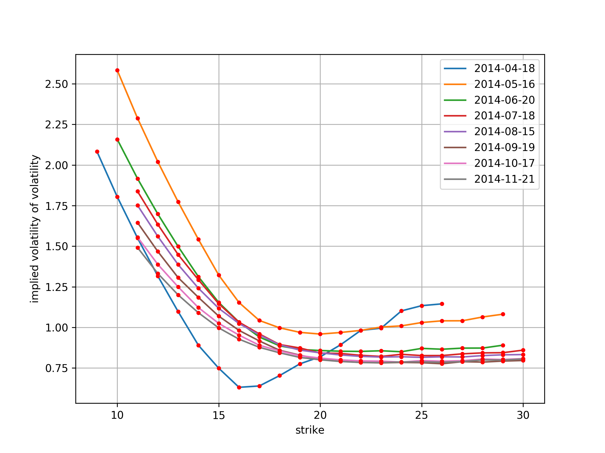
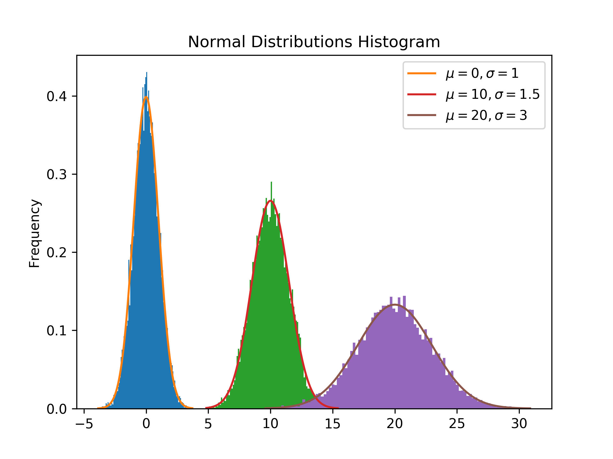
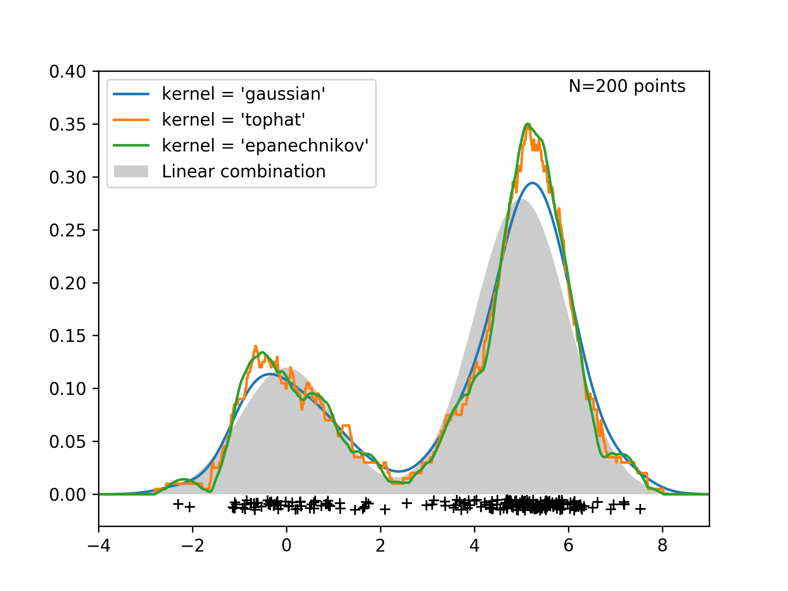
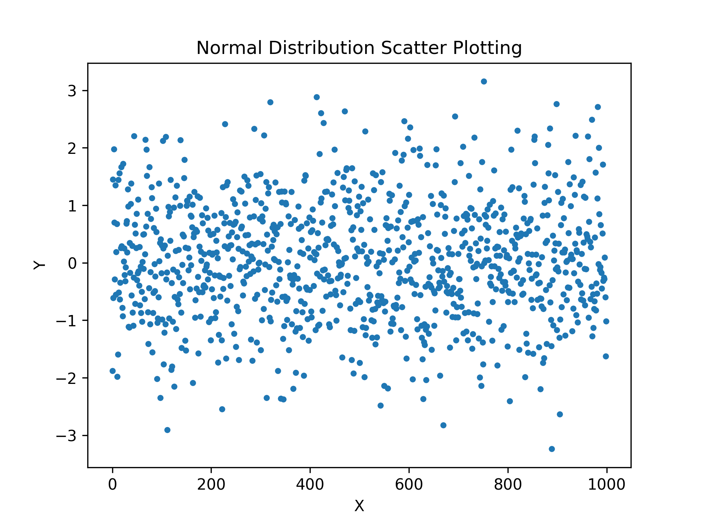
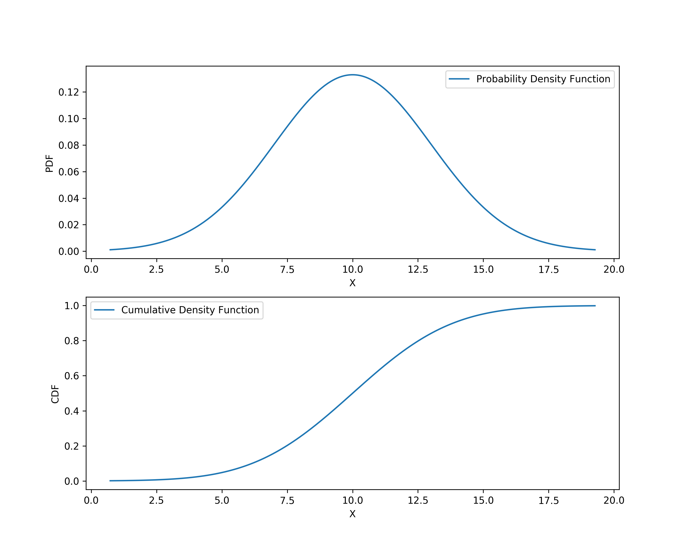
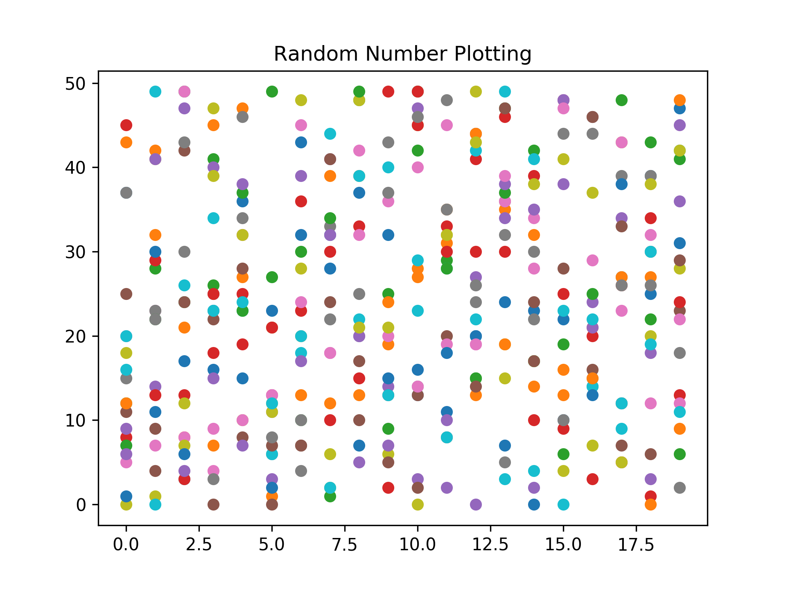

[](http://quantlet.de/)

## [](http://quantlet.de/) **DEDA_Class_2017_Statistics&Finance** [](http://quantlet.de/)

```yaml

Name of Quantlet : DEDA_Class_2017_Statistics&Finance
Published in : Digital Economy and Decision Analytics
Description :
- Demonstrate Linear Opearation and Fourier Transform Using Nympy
- Draw plot normal distributed random variables and sample's PDF and CDF using Matplotlib
- Demonstrate different kernel density estimations
- Use Black-Scholes Model to price options
- Simulate implied volatility and plot volatility smile

Keywords :
- Python
- Teaching
- Numpy
- Scipy
- Matplotlib
- PDF/CDF
- KDE
- Black-Scholes
- Implied Volatility

Author : Junjie Hu, Yves Hilpisch

```














### PYTHON Code
```python

import numpy as np
import matplotlib.pyplot as plt
from scipy.stats import norm
from sklearn.neighbors import KernelDensity

# Code reference: http://scikit-learn.org/stable/auto_examples/neighbors/plot_kde_1d.html

N = 200
np.random.seed(1)
# Create 2 normal distributed data set
norm_data_1 = np.random.normal(0, 1, int(0.3 * N))
norm_data_2 = np.random.normal(5, 1, int(0.7 * N))
norm_data = np.concatenate((norm_data_1, norm_data_2))

# Create x axis range
X_plot = np.linspace(-5, 10, 1000)
# Create linear combination of 2 normal distributed random variable
norm_linear = (0.3 * norm(0, 1).pdf(X_plot) + 0.7 * norm(5, 1).pdf(X_plot))

fig, ax = plt.subplots()
# Plot the real distribution
ax.fill(X_plot, norm_linear, fc='black', alpha=0.2, label='Linear combination')
# Use 3 different kernel to estimate
for kernel in ['gaussian', 'tophat', 'epanechnikov']:
    # Initial an object to use kernel function to fit data, bandwidth will affect the result
    kde = KernelDensity(kernel=kernel, bandwidth=0.5).fit(norm_data.reshape(-1, 1))
    # Evaluate the density model on the data
    log_dens = kde.score_samples(X_plot.reshape(-1, 1))
    ax.plot(X_plot, np.exp(log_dens), '-', label="kernel = '{0}'".format(kernel))

# Add text on the plot, position argument can be arbitrary
ax.text(6, 0.38, "N={0} points".format(N))
ax.legend(loc='upper left')
# Plot the random points, squeeze them into narrow space
ax.plot(norm_data, -0.005 - 0.01 * np.random.random(norm_data.shape[0]), '+k')
# Set x-axis y-axis limit to adjust the figure
ax.set_xlim(-4, 9)
ax.set_ylim(-0.03, 0.4)
fig.savefig('kernel_estimation.png', dpi=300)
plt.show()

```

automatically created on 2018-09-04