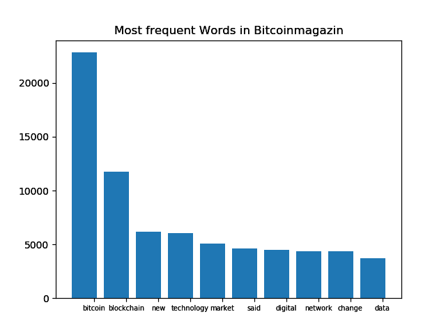

[](http://quantlet.de/)

## [](http://quantlet.de/) **DEDA_WebScrapingInCryptocurrencies** [](http://quantlet.de/)

```yaml

Name of Quantlet : DEDA_WebScrapingInCryptocurrencies
Published in : Digital Economy and Decision Analytics
Description : Extract sentiment from Bitcoin related news and use sentiment to forecast price

Keywords :
- Cryptocurrency
- Bitcoin
- News Sentiment
- Forecasting

Author : Alex
```




### PYTHON Code
```python

import pandas as pd
import datetime
import matplotlib.pyplot as plt
import math
import numpy as np
# xlrd must be downloaded first
import xlrd

'''
Use Loughran McDonald dictionary to extract sentiment
'''

# df = pd.read_excel('LoughranMcDonald_MasterDictionary_2014.xlsx')

# Rearrange the negativ/positive words of the McDonalds Textfile
McD_neg = list(open('LoughranMcDonald_Negative.csv'))
McD_neg_str = "".join(str(McD_neg))
McD_neg = McD_neg_str.lower()
McD_neg = McD_neg.replace(',2009\\n', '')

McD_pos = list(open('LoughranMcDonald_Positive.csv'))
McD_pos_str = "".join(str(McD_pos))
McD_pos = McD_pos_str.lower()
McD_pos = McD_pos.replace(',2009\\n', '')

# Find all negatives in Bitcoin Magazin articles:
neg_list = []
neg_list_L = []
for article in magazin_list:
    negatives = [w for w in article if w in McD_neg]
    neg_list.append(negatives)
    neg_list_L.append(len(negatives))

# Find all positivs in Bitcoin Magazin articles
pos_list = []
pos_list_L = []
for article in magazin_list:
    positives = [w for w in article if w in McD_pos]
    pos_list.append(positives)
    pos_list_L.append(len(positives))

# Bullish/Bearish indicators:
count = 0
indic_list = []
for article in magazin_list:
    count += 1
    indic_list.append(math.log((1 + (pos_list_L[count - 1] / magazin_list_L[count - 1])) /
                               (1 + (neg_list_L[count - 1] / magazin_list_L[count - 1]))) / math.log(2))

'''
Use Cathy Chen dictionary to extract sentiment
'''

# Rearrange the negativ/positive words of the dictionary
cryp_sent = pd.read_csv("Crypto_dictionary_2017.csv")
cryp_sent_key = cryp_sent["keyword"].tolist()
cryp_sent_sw = cryp_sent["sw"].tolist()

##Extract sentiment
# Returns all words found in btc_articles that match dictionary_Chen
sent_score_full = []

for article in magazin_list:
    sent_score = []
    positives = [w for w in article if w in cryp_sent_key]
    print(positives)
    for word in positives:
        sent = cryp_sent[cryp_sent["keyword"] == word]
        sent_score += sent["sw"].tolist()
    sent_score_full.append(sent_score)

# Average over sentiments for single articles
avg_sent_score = []
count = 0
for article in sent_score_full:
    avg_sent_score.append(np.mean(sent_score_full[count]))
    count += 1

# Add sentiment to bitcoin dataframe:
bitcoin_df = pd.read_csv("Bitcoin_magazin_news.csv")
bitcoin_df["sentiment_McD"] = indic_list
bitcoin_df["sentiment_Chen"] = avg_sent_score

# Add btc_prices to bitcoin dataframe:
bitcoin_df["time"] = bitcoin_df["time"].apply(lambda x:
                                              datetime.datetime.strptime(x, '%Y-%m-%d %H:%M:%S'))
bitcoin_df["time"] = bitcoin_df["time"].dt.date

bitcoin_df.index = bitcoin_df["time"]

btc_price = btc_price.to_frame()

btc_merge = pd.merge(bitcoin_df, btc_price, how='inner', left_index=True, right_index=True)

btc_merge.to_csv('Bitcoin_Magazin_Final.csv')

bitcoin_df = pd.read_csv("Bitcoin_Magazin_Final.csv")

# Group by day of sentiment

df_sent_Chen = bitcoin_df["sentiment_Chen"].groupby(by=bitcoin_df.index, axis=0).apply(lambda x: x.mean())

df_sent_McD = bitcoin_df["sentiment_McD"].groupby(by=bitcoin_df.index, axis=0).apply(lambda x: x.mean())

df_btc_price = bitcoin_df["avg_BTC_price"].groupby(by=bitcoin_df.index, axis=0).apply(lambda x: x.mean())

```

automatically created on 2018-09-04