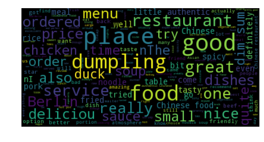
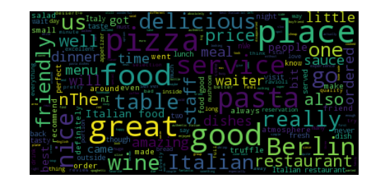

[](http://quantlet.de/)

## [](http://quantlet.de/) **DEDA_Class_2017_WordCloudandSentimentAnalysiswithYelpReviews** [](http://quantlet.de/)

```yaml

Name of Quantlet : DEDA_Class_2017_WordCloudandSentimentAnalysiswithYelpReviews
Published in : Digital Economy and Decision Analytics
Description : Crawl user-published reviews on Yelp and apply text mining and machine learing techniques using Python. Web Scraping and Word Cloud, Sentiment Analysis using Textblob, Sentiment Classification using SVM

Keywords :
- Python
- BeautifulSoup
- Textblob
- Sklearn
- Textblob
- Support vector machine
- Sentiment classification

Author : Xun Gong
```





### PYTHON Code
```python

import pandas as pd
import matplotlib.pyplot as plt

from textblob import TextBlob
from itertools import *
from matplotlib import rcParams
rcParams.update({'figure.autolayout': True})


reviews_df = pd.read_csv('Reviews_cn.csv', encoding = 'cp1252')
# print(reviews_df.shape)
# print(reviews_df.head())

# get only reviews text and rating stars
reviews_df = reviews_df[['Review Rating', 'Review']]
print(reviews_df.head())

# print(reviews_df['Review'][0])
# print(reviews_df['Review Rating'][0])

# details = TextBlob(reviews_df['Review'][0])
# print(details.sentiment)

tb_score = []
stars = []
for ind,review in islice(reviews_df.iterrows(),271):
    details = TextBlob(review['Review'])
    tb_score.append(details.sentiment.polarity)
    stars.append(review['Review Rating'])

stars_tbscore = pd.DataFrame()
stars_tbscore['Review Rating'] = stars
stars_tbscore['senti_value'] = tb_score

ax = stars_tbscore.boxplot(by=['Review Rating'], figsize=(10,6))
plt.style.use('seaborn-white')
ax.get_figure().suptitle("")
ax.set_title('Average sentiment score and Star rating - Using Textblob.')
ax.set_xlabel('Yelp Review Rating')
ax.set_ylabel('Average sentiment score')
ax.grid(False)

fig1 = plt.gcf()
plt.show()
fig1.savefig("boxplot.png", transparent = True)


```

automatically created on 2018-09-04